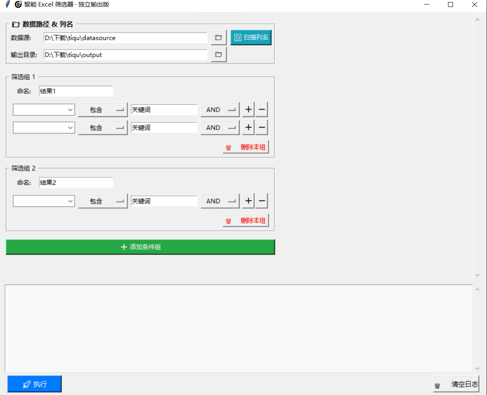
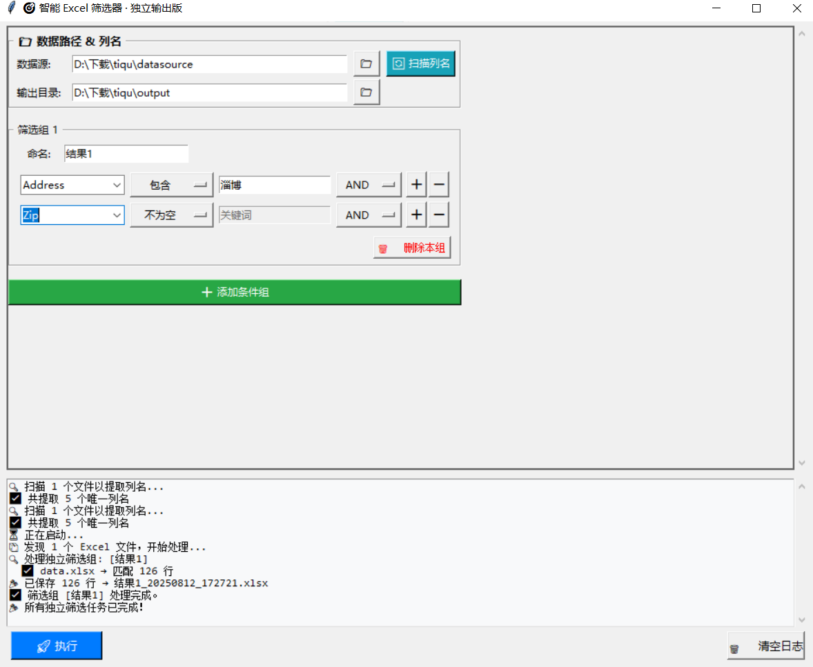

# 🎯 Smart Excel Filter – 智能 Excel 多条件筛选工具

[](https://opensource.org/licenses/MIT)  
一个简单易用的图形化工具，帮助你**无需编写代码**，即可从多个 Excel 文件中快速筛选数据，并支持**多组独立输出**。

> ✅ 无需 Python 基础  
> ✅ 支持 `.xlsx` / `.xls`  
> ✅ 可直接运行 `.exe`（Windows）  
> ✅ 也支持源码运行与二次开发

---

## 📦 功能亮点

- 🔍 **自动扫描列名**：点击“扫描列名”即可加载所有字段，下拉选择更准确
- 🧩 **灵活条件组合**：支持“包含”、“等于”、“>”、“为空”等多种操作符
- 🔗 **组内逻辑控制**：AND / OR 自由连接多个条件
- 📁 **多组独立输出**：每个筛选组生成一个独立结果文件（非合并）
- 💾 **一键导出 Excel**：结果自动去重并保存为 `.xlsx`
- 🖥️ **图形化界面**：简洁直观，非技术人员也能轻松使用
- 🚀 **无需安装 Python**：提供编译好的 `.exe` 可执行程序

---

## 🧰 应用场景举例

### ✅ 场景 1：销售数据分析
> 从多个区域的销售表中，分别提取：
- 华东区订单 → 输出 `华东区.xlsx`
- 金额 > 10000 的大单 → 输出 `大额订单.xlsx`
- 状态为“已完成”的订单 → 输出 `已完成订单.xlsx`

> 每个条件组独立运行，互不干扰。

---

### ✅ 场景 2：人事信息筛选
> 从各部门员工表中提取：
- 所有“部门 = 技术部”的员工
- “入职时间 < 2020年”的老员工
- “邮箱为空”的人员（用于补录）

> 每组条件输出一个文件，便于后续处理。

---

### ✅ 场景 3：财务对账辅助
> 批量检查多个账单文件：
- 筛出“发票号重复”的记录
- 提取“未开票”状态的条目
- 查找“金额异常（>10万）”的交易

> 快速定位问题数据，提升效率。

---

## 🚀 使用方式

你可以选择以下任意一种方式使用本工具：

---

### 方式一：直接运行 `.exe`（推荐 | 无需安装 Python）

适用于 **Windows 用户**，双击即可使用。

#### 1. 下载发布包
前往 [Releases](https://github.com/ihmod/smart-excel-filter/releases) 页面下载：
```
smart_excel_filter_v1.0.zip
```

#### 2. 解压并运行
```bash
unzip smart_excel_filter_v1.0.zip
cd smart_excel_filter_v1.0
smart_excel_filter.exe
```

> 📁 程序会自动创建 `datasource/` 和 `output/` 文件夹  
> 📎 将你的 Excel 文件放入 `datasource/` 开始筛选！

---

### 方式二：从源码运行（适合开发者或自定义）

适用于希望修改功能、参与开发或跨平台使用的用户。推荐python>3.6的环境

#### 1. 克隆项目
```bash
git clone https://github.com/ihmod/smart-excel-filter.git
cd smart-excel-filter
```

#### 2. 安装依赖
```bash
pip install pandas openpyxl xlrd
```

> 💡 推荐使用虚拟环境：
> ```bash
> python -m venv venv
> .venv\Scripts\activate   # Windows
> source venv/bin/activate # Mac/Linux
> ```

#### 3. 运行程序
```bash
python smart_excel_filter.py
```

---

### 方式三：自行编译 `.exe`（高级用户）

如果你想自己打包或修改后发布：

#### 1. 安装打包工具
```bash
pip install pyinstaller
```

#### 2. 执行打包命令
```bash
pyinstaller -F -w  --add-data "datasource;datasource"  --add-data "output;output"  -i icon.ico  smart_excel_filter.py
```

> ✅ 编译完成后，`dist/smart_excel_filter.exe` 即可独立分发

---

# 📁 说明
### 项目结构
```
smart-excel-filter/
├── smart_excel_filter.py     # 主程序源码
├── datasource/               # 放置待处理的 Excel 文件
├── output/                   # 筛选结果自动保存在此
├── icon.ico                  # 程序图标（可选）
├── README.md                 # 本说明文件
└── requirements.txt          # 依赖列表（见下文）
```
### 📄 依赖列表 (requirements.txt)
```txt
深色版本
pandas>=1.3.0
openpyxl>=3.0.0
xlrd>=2.0.0
```
安装命令：

```bash
深色版本
pip install -r requirements.txt
```
### 运行截图



### 流程图（文字版）

```
启动程序
   ↓
选择使用方式
   ├── 方式一：直接运行 .exe（Windows）
   │       → 双击运行
   │       → 自动创建 datasource/ 和 output/
   │
   └── 方式二：源码运行
           → 安装依赖 (pip install -r requirements.txt)
           → 运行 Python 脚本

   ↓
进入图形界面 (GUI)
   ↓
点击「扫描列名」→ 自动读取所有 Excel 文件的列名
   ↓
添加一个或多个「筛选组」
   ↓
每组内可设置多个条件：
   字段名 [下拉选择] 
   操作符 [包含/等于/为空/...]
   值 [输入关键词]
   逻辑 [AND/OR]
   ↓
点击「执行」
   ↓
程序自动：
   1. 读取 datasource/ 下所有 Excel 文件
   2. 对每组条件独立筛选
   3. 每组生成一个结果文件（如：结果组A_20250812.xlsx）
   4. 保存到 output/ 目录
   ↓
完成！打开 output/ 查看结果
```
---

## 🛠️ 已知限制与建议

- ❗ 编译运行的程序包目前仅支持 **Windows 平台 `.exe`**
- ⏳ 首次扫描列名可能稍慢（取决于文件数量）
- 💡 建议将 Excel 文件放在 `datasource/` 目录下统一管理
- 📊 不适合超大文件（单文件 > 100MB），内存可能不足

---
## 🙌 致谢

感谢使用！希望这个小工具能帮你**每天节省一小时** 😊  
如果你觉得有用，不妨点个 ⭐ Star 支持一下！
✅ **现在就开始，把繁琐的数据筛选交给自动化吧！**

---

## 📄 许可证

本项目采用 [MIT License](LICENSE) 开源协议，可自由使用、修改和分发。

